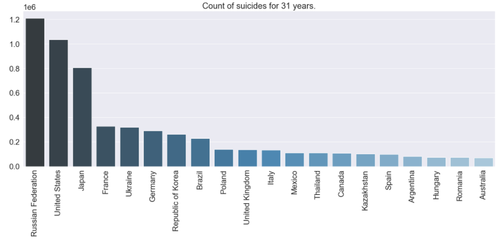
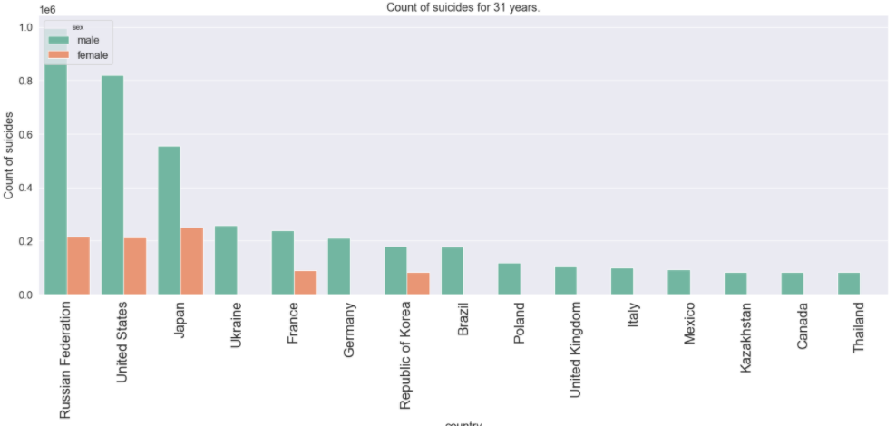
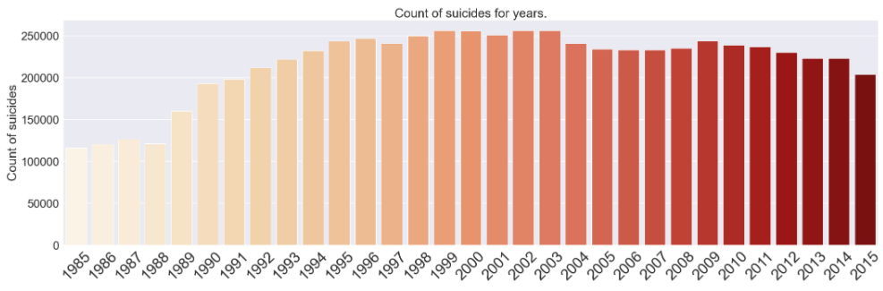

# Suicide_Rates

## Resources Used 
**Python Version:** 3.7  

**Packages:** pandas, numpy, matplotlib, seaborn 

**Data source:** https://www.kaggle.com/russellyates88/suicide-rates-overview-1985-to-2016

## Exploratory Data Analysis
I looked at the data and made charts showing statistics about commited suicides all over the world for the past 31 years. As we can see, Russia is leading which was actually surprisingly for me

